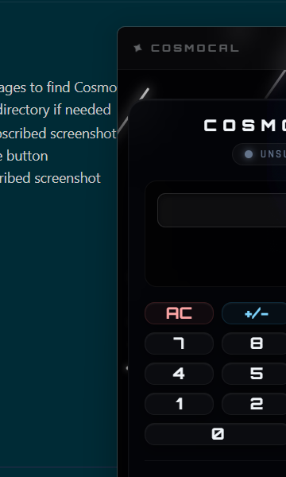
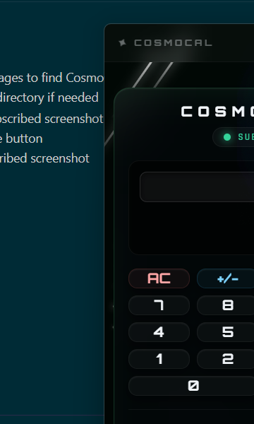

# 🌙 CosmoCal — Space-Themed Calculator

> A premium Windows desktop calculator with a dark space aesthetic, animated starfield, moon backdrop, and a satirical subscription paywall that intentionally breaks math when unpaid.

---

## ✨ Features

- **Space-Themed UI** — Deep dark background, animated falling stars, twinkling starfield, and a luminous moon
- **Custom Borderless Window** — No ugly native title bar; replaced with a sleek macOS-style traffic-light control strip
- **Draggable Window** — Drag anywhere on the title bar to move the app
- **Resizable Edges** — Native resize handles on all 8 edges
- **Full Keyboard Support** — Type numbers and operators directly from keyboard
- **Subscription Paywall (Satirical)** — Without a subscription, the calculator gives intentionally wrong answers with sarcastic messages
- **24-Hour Access** — Subscription expires after 24 hours with a live countdown timer
- **Custom App Icon** — Custom `.ico` applied to the executable, taskbar, Alt+Tab, and favicon

---

## 📸 Screenshots

### 🔴 Without Subscription (Unsubscribed)

> Math answers are intentionally incorrect. Sarcastic messages are shown.



---

### 🟢 With Subscription (Subscribed)

> Full access — correct answers, green accent glow, countdown timer active.



---

## 🛠️ Tech Stack

| Layer | Technology |
|---|---|
| **Desktop Shell** | Windows Forms (WinForms) — .NET 10 |
| **UI Framework** | Blazor WebView (WebView2) |
| **Styling** | Vanilla CSS — Glassmorphism & dark theme |
| **Fonts** | Orbitron · Rajdhani (Google Fonts) |
| **Language** | C# 13 / Razor |
| **Target** | `net10.0-windows` |

---

## 🚀 Getting Started

### Prerequisites

- [.NET 10 SDK](https://dotnet.microsoft.com/download)
- Windows 10 / 11
- WebView2 Runtime (comes pre-installed on Windows 11; [download here](https://developer.microsoft.com/microsoft-edge/webview2/) for Windows 10)

### Run Locally

```bash
git clone https://github.com/YashKanaujia/CosmoCal.git
cd CosmoCal/CosmoCal/CosmoCal
dotnet run
```

### Build & Publish

```bash
# Debug build
dotnet build

# Self-contained Windows publish
dotnet publish -c Release -r win-x64 --self-contained true -o ./publish
```

---

## 🗂️ Project Structure

```
CosmoCal/
├── Components/
│   ├── App.razor               # Root Blazor component
│   └── Pages/
│       └── Calculator.razor    # Main calculator UI + logic
├── Services/
│   ├── SubscriptionService.cs  # Manages 24-hr subscription state
│   ├── CalculatorEngine.cs     # Math logic (correct vs. intentionally wrong)
│   └── WindowControlService.cs # Bridges Blazor title bar → WinForms window ops
├── wwwroot/
│   ├── css/app.css             # Full dark space theme stylesheet
│   ├── images/moon.png         # Moon backdrop asset
│   └── index.html              # WebView2 host page + favicon
├── Form1.cs                    # Borderless WinForms host, Win32 interop
├── Program.cs                  # App entry point
├── icon.ico                    # Custom application icon
└── docs/
    ├── screenshot_unsubscribed.png
    └── screenshot_subscribed.png
```

---

## 🎨 Design Highlights

| Element | Detail |
|---|---|
| **Title Bar** | 44px custom bar with rotating ✦ star logo + macOS traffic-light buttons |
| **Window Controls** | 🟡 Minimize · 🟢 Maximize · 🔴 Close — icons appear on hover |
| **Drag Support** | `-webkit-app-region: drag` via WebView2 `IsNonClientRegionSupportEnabled` |
| **Moon** | Absolutely positioned, `mix-blend-mode: screen`, with slow pulse animation |
| **Starfield** | 60 deterministically seeded twinkling stars |
| **Falling Stars** | 15 animated diagonal streaks |
| **Rounded Corners** | Windows 11 DWM `DWMWCP_ROUND` attribute |
| **Drop Shadow** | DWM `DWMNCRP_ENABLED` for borderless window shadow |

---

## 💳 Subscription System

The subscription system is **intentionally satirical** — a parody of aggressive SaaS paywalls.

| State | Behaviour |
|---|---|
| **Unsubscribed** | Calculator gives wrong answers and shows sarcastic messages |
| **Processing** | Button shows pulsing `⠙ PROCESSING...` animation |
| **Subscribed** | Correct answers, green glow, live 24-hour countdown |
| **Expired** | Reverts to unsubscribed state automatically |

> Price: ₹100 / day · 24-hour access

---

## 📄 License

MIT — feel free to use, fork, and extend.

---

<p align="center">Made with 🌙 and too much CSS</p>
